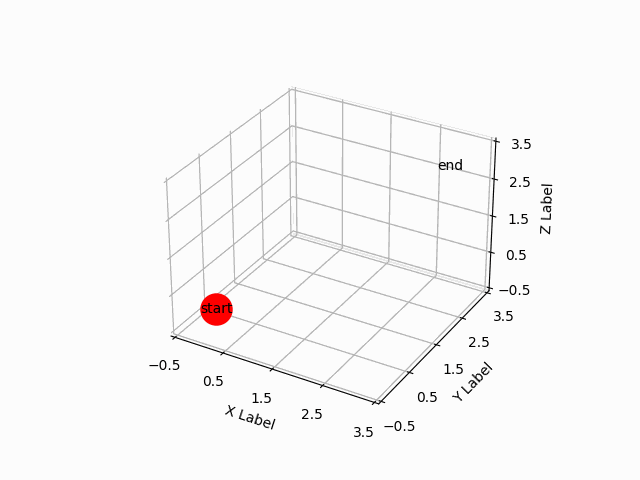

# RL-Study Assignment #1

DS-Lab Reinforcement Learning Study를 위한 코드입니다.

자세한 내용은 아래 링크를 참조하세요.

Link : [RL for Starter][gymnasium]

[gymnasium]: https://guebin.github.io/SP2023/posts/4.%20%EA%B0%95%ED%99%94%ED%95%99%EC%8A%B5/A1.html#%ED%99%98%EA%B2%BD%EC%85%8B%ED%8C%85 "gymnasium"

## 1. 환경설정

<pre><code>conda install swig
conda install gymnasium
conda install gymnasium[box2d]
conda install matplot
conda install IPython
</code></pre>

## 2. Grid 3D
위에 걸어둔 예제의 4X4 GRID 문제를, 4X4X4의 3차원 Grid 문제로 바꾸어 해결하였습니다. Policy Update에 Greedy, Epsilon Greedy 방법을 적용하였습니다. 결과는 아래와 같습니다.

### 2-1. Random Step

### 2-2. Epsilon Greedy

